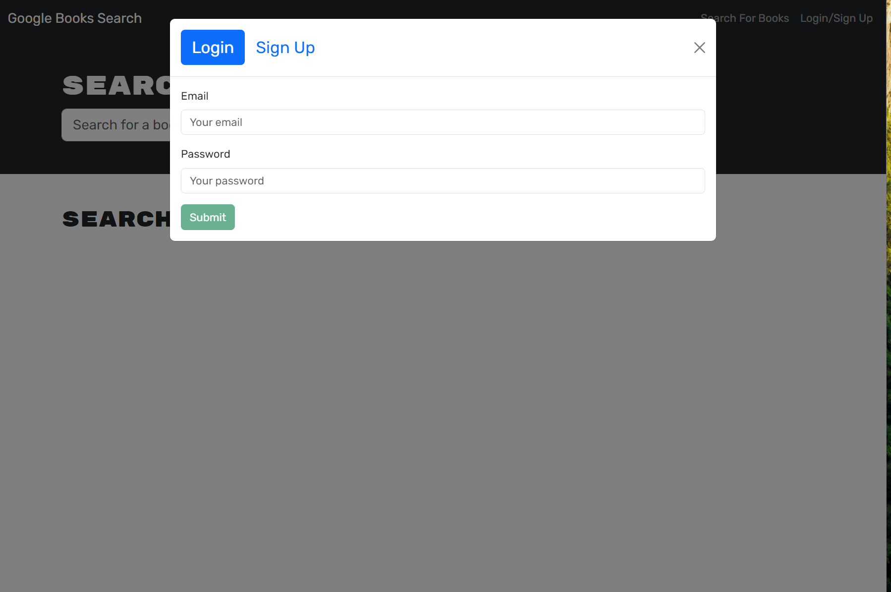
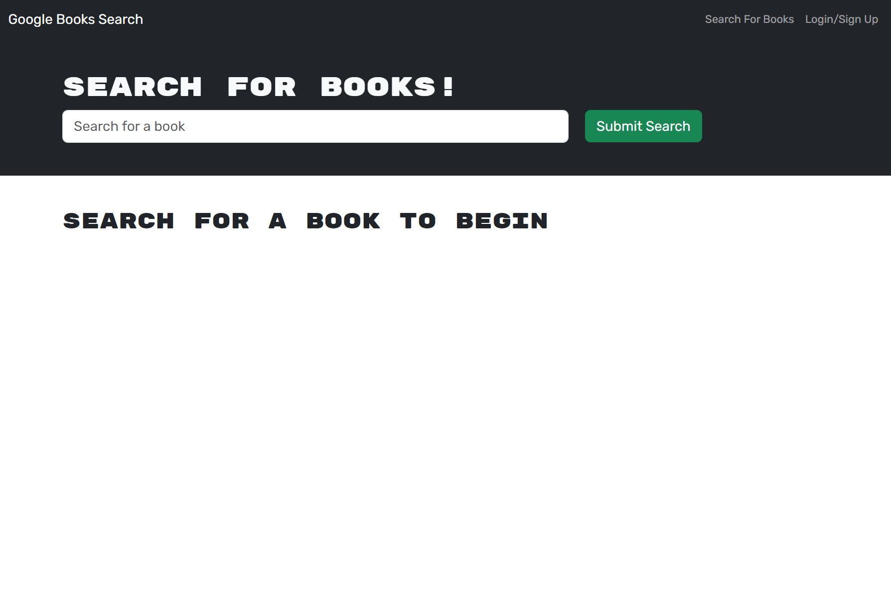
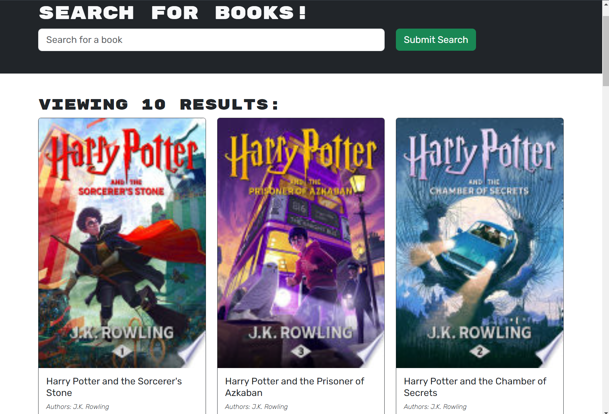

# Book Search Engine
**Deployed Link:** https://two1-module-21-book-search-engine.onrender.com/
## Overview
This project is a book search engine that allows users to search for books using the Google Books API and save their favorite books. Originally built with a RESTful API, it has been refactored to use a GraphQL API with Apollo Server. The application is built using the MERN stack: MongoDB, Express.js, React, and Node.js.

## Table of Contents
- [Overview](#overview)
-[Installation](#installation)
- [Usage](#usage)
- [Features](#features)
- [Technologies Used](#technologies-used)
- [Deployment](#deployment)
- [User Story](#user-story)
- [Acceptance Criteria](#acceptance-criteria)
- [Screenshots]()
- [Credits](#credits)
- [License](#license)

## Installation
To set up the project locally, follow these steps:

1. Clone the repository:
```bash
git clone <your-repo-url>
cd book-search-engine
```
2. Install the dependencies:
```bash
npm install
```
3. Set up environment variables:
```bash
- Create a .env file in the root directory.
- Add the following environment variables:
MONGODB_URI=<your-mongodb-uri>
JWT_SECRET=<your-jwt-secret>
```
4. Run the development server:
```bash
npm run develop
```

## Usage
1. Open the application in your browser at http://localhost:3000.
2. Use the search bar to find books via the Google Books API.
3. Sign up or log in to save your favorite books.
4. View your saved books by navigating to the "Saved Books" section.
5. Remove books from your saved list if desired.

## Features
- Search Books: Search for books using the Google Books API.
- Authentication: Sign up and log in to save books.
- Save Books: Save favorite books to your account.
- View Saved Books: View all books saved to your account.
- Remove Books: Remove books from your saved list.

## Technologies Used
**Frontend:**
- React
- React Bootstrap
- Apollo Client

**Backend:**

- Node.js
- Express.js
- Apollo Server
- MongoDB
- GraphQL

## Deployment
**The application is deployed on Render. Follow these steps to deploy:**

1. Push your code to a repository on GitHub.
2. Create a new web service on Render and connect it to your GitHub repository.
3. Set up the environment variables on Render.
4. Deploy the application.

## User Story
```bash
AS AN avid reader
I WANT to search for new books to read
SO THAT I can keep a list of books to purchase
```

## Acceptance Criteria
- Initial Load: On loading the search engine, present a menu with options for "Search for Books" and "Login/Signup" along with a search input field and submit button.
- Search: Provide an input field to search for books and a submit button.
- Search Results: Display search results with each book's title, author, description, image, and a link to the book on Google Books.
- Login/Signup: Provide a modal with options to log in or sign up.
- Account Creation: Create an account with a username, email, and password.
- Login: Log in with email and password.
- Menu Options: Change menu options to "Search for Books", "Saved Books", and "Logout" when logged in.
- Save Books: Save books to the user's account.
- View Saved Books: View saved books with options to remove them.
- Logout: Log out of the account and revert menu options.

## Screenshots
 - Sign Up Page

 - Home Page

 - Book Page

 - Saved Book Page 

## Credits
Start Code Given: https://github.com/coding-boot-camp/solid-broccoli
Special thanks to my teachers, Drew and Kyle, for their guidance and support in teaching me the right methods to complete this module. Drew's speed runs were particularly helpful.

## License
This project is licensed under the MIT License.